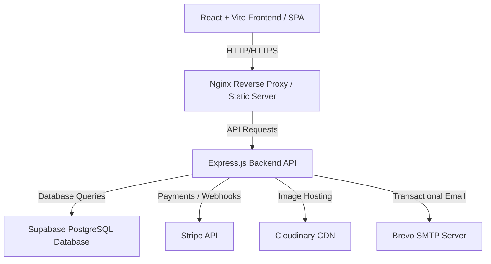

# 🏌️‍♂️ Golf Charity Platform

A production-grade, full-stack platform designed to bridge golf enthusiasts and charity organizations. The platform allows users to log golf scores, subscribe to draw entries using Stripe, support various golf charities, and view draw winnings. It includes a comprehensive Admin Dashboard to manage users, draws, scores, charities, and prize pools.

---

## 🚀 Architecture Overview

The application is built using a modern **Three-Tier Architecture** and is fully containerized with **Docker**:



---

## 🛠️ Technology Stack

### Frontend (Client)
- **Framework:** React 19 & Vite 8
- **Styling:** Tailwind CSS v4 & Framer Motion (smooth animations)
- **Routing:** React Router Dom v7
- **HTTP Client:** Axios
- **Notifications:** React Hot Toast

### Backend (Server)
- **Runtime:** Node.js & Express.js (v5)
- **Database:** Supabase (PostgreSQL client)
- **Authentication:** JSON Web Tokens (JWT) & bcryptjs
- **File Uploads:** Multer & Cloudinary
- **Payments:** Stripe SDK & Stripe Webhooks
- **Mailing:** Nodemailer (configured with Brevo SMTP)

### DevOps & Deployment
- **Containerization:** Docker & Docker Compose
- **Web Server:** Nginx (built into the client container)
- **CI/CD:** GitHub Actions (automated SSH deployment to AWS EC2)

---

## 📂 Project Structure

```text
Golf-Charity-Platform/
├── .github/workflows/   # CI/CD Workflows
│   └── deploy.yml       # GitHub Actions deployment to AWS EC2
├── client/              # React SPA
│   ├── src/             # Frontend source code
│   │   ├── components/  # Reusable UI components
│   │   ├── pages/       # Route-level pages (Dashboard, Admin, Home, etc.)
│   │   ├── services/    # Axios API instance
│   │   └── App.jsx      # Navigation routing & main layout
│   ├── Dockerfile       # Nginx & React Multi-stage build
│   └── nginx.conf       # Reverse proxy configuration for frontend routing
├── server/              # Express API Server
│   ├── src/             # Backend source code
│   │   ├── config/      # Third-party configurations (Stripe, Cloudinary, Supabase)
│   │   ├── controllers/ # Route controller handlers
│   │   ├── middleware/  # JWT & role authorization middleware
│   │   ├── routes/      # API Route endpoint definitions
│   │   └── services/    # Business services (e.g., Notifications)
│   └── Dockerfile       # Production Node.js environment
└── docker-compose.yml   # Multi-container local orchestra file
```

---

## 💾 Database Schema (Supabase PostgreSQL)

The platform relies on the following database tables:
- **`users`**: Stores user profiles, credentials, role permissions (`user` vs `admin`), and charity associations.
- **`subscriptions`**: Tracks Stripe subscriptions (status, price ID, renewal times).
- **`charities`**: Registry of supported non-profit organizations.
- **`scores`**: Stores logged golf scores and handicap details.
- **`draws`**: Weekly/monthly charity sweepstakes settings.
- **`prize_pools`**: Available prizes linked to active draws.
- **`winners`**: Records drawn winners and their prizes.

---

## ⚙️ Environment Variables

### Backend Configuration (`server/.env`)
Create a `.env` file inside the `server/` directory:

| Key | Description | Example |
|---|---|---|
| `PORT` | Local server port | `5000` |
| `CLIENT_URL` | Allowed CORS origin (Frontend domain) | `http://localhost` |
| `SUPABASE_URL` | Supabase project API URL | `https://xxxx.supabase.co` |
| `SUPABASE_SERVICE_ROLE_KEY` | Supabase service role API key | `eyJhbGciOiJIUzI1Ni...` |
| `JWT_SECRET` | Secret key for signing authorization tokens | `your_jwt_secret` |
| `CLOUDINARY_CLOUD_NAME` | Cloudinary storage cloud name | `your_cloud_name` |
| `CLOUDINARY_API_KEY` | Cloudinary API Key | `your_api_key` |
| `CLOUDINARY_API_SECRET` | Cloudinary API Secret | `your_api_secret` |
| `STRIPE_SECRET_KEY` | Stripe developer secret key | `sk_test_...` |
| `STRIPE_MONTHLY_PRICE_ID` | Monthly subscription price ID | `price_...` |
| `STRIPE_YEARLY_PRICE_ID` | Yearly subscription price ID | `price_...` |
| `STRIPE_MONTHLY_AMOUNT` | Monthly membership amount (cents) | `250` (e.g., $2.50) |
| `STRIPE_YEARLY_AMOUNT` | Yearly membership amount (cents) | `2500` (e.g., $25.00) |
| `STRIPE_WEBHOOK_SECRET` | Secret verifying Stripe webhook events | `whsec_...` |
| `SMTP_HOST` | Transacational SMTP host (Brevo, SendGrid, etc.) | `smtp-relay.brevo.com` |
| `SMTP_PORT` | SMTP Port | `587` |
| `SMTP_USER` | SMTP Username | `username@smtp.com` |
| `SMTP_PASS` | SMTP Password / API Key | `smtp_password` |
| `FROM_EMAIL` | Sender email address | `noreply@golfcharity.com` |

### Frontend Configuration (`client/.env`)
Create a `.env` file inside the `client/` directory:

| Key | Description | Example |
|---|---|---|
| `VITE_API_BASE_URL` | Server API endpoint URL | `http://localhost:5000/api` |

---

## 🏃 Local Setup & Running the Project

### Method 1: Using Docker Compose (Recommended)
Make sure you have Docker installed.

1. Clone the repository and navigate to the project directory:
   ```bash
   git clone <repo-url>
   cd Golf-Charity-Platform
   ```
2. Set up the `.env` files in `client/` and `server/` directories.
3. Start the application:
   ```bash
   docker compose up --build
   ```
4. The client will be accessible at [http://localhost](http://localhost) (port 80) and the backend API at [http://localhost:5000](http://localhost:5000).

### Method 2: Manual Local Running
If you prefer running the application outside of Docker:

#### 1. Start Backend API
```bash
cd server
npm install
npm run dev
```
The server will run on `http://localhost:5000` with `nodemon` auto-reloading.

#### 2. Start Frontend Client
```bash
cd client
npm install
npm run dev
```
The Vite hot-reload dev server will run on `http://localhost:5173`.

---

## 🚢 CI/CD Deployment

Deployments are automated through a **GitHub Actions** workflow (`deploy.yml`):
1. Runs whenever a push is made to the `main` branch.
2. Connects to the AWS EC2 instance via SSH using repository secrets (`EC2_HOST`, `EC2_USERNAME`, `EC2_PRIVATE_KEY`).
3. Navigates to the workspace directory.
4. Pulls the latest commits.
5. Invokes `docker compose up -d --build` to build and deploy with zero manual downtime.
